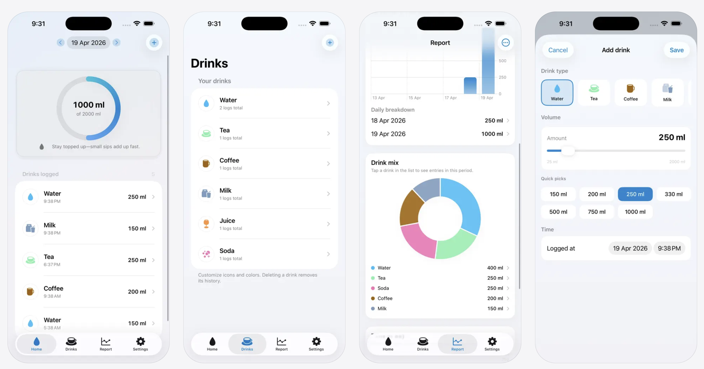

# WaterLog

A SwiftUI hydration tracker for iPhone and iPad. Log drinks by type and volume, follow a daily goal, review trends in charts, and keep everything **on device**—no account required.

## App Store

WaterLog is now live on the App Store:  
[WaterLog - Track Drinks](https://apps.apple.com/us/app/waterlog-track-drinks/id6762547284)

## Screenshots



## Features

- **Home** — Day-by-day timeline, progress toward your goal, add and edit logs, swipe to delete  
- **Drinks** — Custom drink types with icons and colors, per-type detail with a monthly activity heatmap  
- **Report** — Volume over time, drink mix, hourly patterns, tappable detail sheets, **CSV export** via the system share sheet  
- **Settings** — Daily goal, metric/imperial units, optional **local** hydration reminders with quiet hours  
- **First launch** — Short onboarding for goal, units, and reminders  
- **Accessibility** — VoiceOver labels on key actions and progress; supports Dynamic Type–friendly layouts where it matters most  

## Tech stack

| Area | Choice |
|------|--------|
| UI | SwiftUI |
| Architecture | MVVM with `@Observable` / `@MainActor` view models |
| Persistence | [SQLiteData](https://github.com/pointfreeco/sqlite-data) (Point-Free) on top of [GRDB.swift](https://github.com/groue/GRDB.swift) |
| DI | [swift-dependencies](https://github.com/pointfreeco/swift-dependencies) (`prepareDependencies`, `defaultDatabase`) |
| Notifications | `UserNotifications` for scheduled local reminders |

## Requirements

- **Xcode** 16+ (recommended; matches Swift 6 toolchain expectations in the project)  
- **iOS** 18.0+ (deployment target for the app target)  
- Apple Developer team selected for signing when running on a device  

Swift Package dependencies resolve automatically from the Xcode project (see **File → Packages → Resolve Package Versions** if needed).

## Getting started

1. Clone the repository.  
2. Open `WaterLog.xcodeproj` in Xcode.  
3. Select the **WaterLog** scheme and a simulator or connected device.  
4. **Signing & Capabilities** — Choose your team under the WaterLog target so the app can install.  
5. Press **Run** (⌘R).  

Command-line build example:

```bash
xcodebuild -scheme WaterLog -destination 'platform=iOS Simulator,name=iPhone 17' build
```

Adjust the simulator name to one installed on your Mac (`xcrun simctl list devices available`).

## Project layout

```
WaterLog/
├── WaterLog/
│   ├── App/              # App entry, tab shell, app model
│   ├── Features/         # Home, Drinks, Report, Settings, Onboarding, Share
│   ├── Database/         # Migrations, @Table models
│   ├── Services/         # Reminder scheduling
│   ├── Utilities/        # Formatting, theme, colors
│   └── PrivacyInfo.xcprivacy
└── WaterLog.xcodeproj
```

## Privacy

WaterLog stores logs and settings in a local SQLite database on the device. There is no built-in analytics or cloud sync; CSV export only shares data when **you** use the share sheet. The app includes a privacy manifest (`PrivacyInfo.xcprivacy`) for App Store submission. In-app **Settings** includes a short **Privacy & data** section with the same story.

## License

Copyright © Apps Bay Limited. All rights reserved unless a separate `LICENSE` file is added to this repository.
